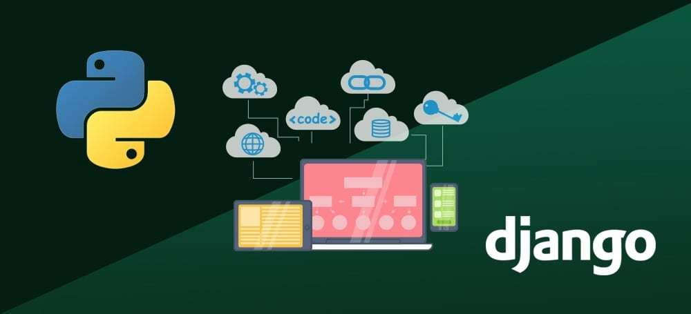
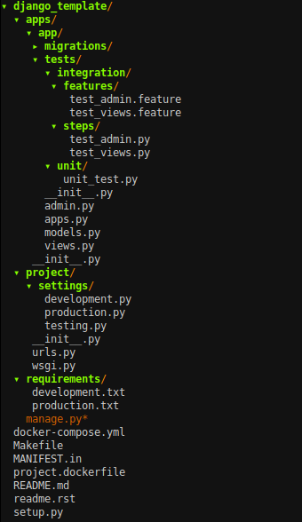

# Django Template

[](https://codecov.io/gh/claudinoac/django-template)


[](https://badge.fury.io/py/django-template)
[](https://www.gnu.org/licenses/gpl-3.0)

A Template for production-ready django-based applications

Featuring:

- Django 3.0
- Container runtime
- Unit (django-test) and Integration (Behave) Tests
- Package auditing via safety and security linting with bandit
- Static linting with flake8 and mypy
- Test and deployment to pipy pipelines via github actions
- Coverage reporting
- Development and Production settings


## Table of Contents:


- [Installation](#installation)
- [Project Architecture](#architecture)
- [Contributing](#contributing)
- [Team](#team)
- [FAQ](#faq)
- [Support](#support)
- [License](#license)

---

## Installation:

### Requisites:
- Install [docker](https://www.docker.com/products/docker-desktop) and [docker-compose](https://docs.docker.com/compose/install/)


### Clone:

- Clone this repository:
	- ` git clone git@github.com:claudinoac/django-template`

### Setup:

- Build and run container:
	+ ```$ docker-compose up -d server```


- Access [http://localhost:3000](http://localhost:3000')

- You're ready to develop your own application

---

## Architecture:




To create an app from our template, run inside the `apps` folder:

- ```$ django-admin startapp --template app_template.zip [app_name]```


---

## Testing:


### Unit tests:

- The unit tests are based on [Django test suite](https://docs.djangoproject.com/en/3.0/topics/testing/)
	
- All the unit tests should be located in apps/app_name/tests/unit/ 
- To run the unit tests, run 
	- ```$ make run-unit-tests```

### Integration tests
- The integration tests are based on [Behave BDD Testing](https://behave.readthedocs.io/en/latest/)

- All the integration tests should be located in apps/app_name/tests/integration

- Every integration test has two parts: the .feature and the .py (steps) file
	- For details, check the [behave's documentation](https://behave.readthedocs.io/en/latest/)

- To run the integration tests, run 
	- ```$ make run-integration-tests```
	
---

## Contributing

> To get started...

### Step 1

- **Option 1**
    - 🍴 Fork this repo!

- **Option 2**
    - 👯 Clone this repo to your local machine using `https://github.com/claudinoac/django-template.git`

### Step 2

- **HACK AWAY!** 🔨🔨🔨

### Step 3

- 🔃 Create a new pull request using <a href="https://github.com/claudinoac/django-template/compare/" target="_blank">`https://github.com/claudinoac/django-template/compare/`</a>.

---

## Team

### Maintainers:
| <a href="http://github.com/claudinoac" target="_blank">**Alisson Claudino**</a>|
| :---: |
| [](http://fvcproductions.com)  |
| <a href="http://github.com/fvcproductions" target="_blank">`github.com/claudinoac`</a> |

### Contributors:
---

## FAQ

- **How can I change my configs?**
    - In the django_template/project/settings/(development|production).py

---

## Support

Reach out to me at one of the following places!

- Twitter at <a href="http://twitter.com/_claudinoac" target="_blank">`@_claudinoac`</a>

---

## License

- **[GNU GPLv3](https://www.gnu.org/licenses/gpl-3.0.en.html)**

